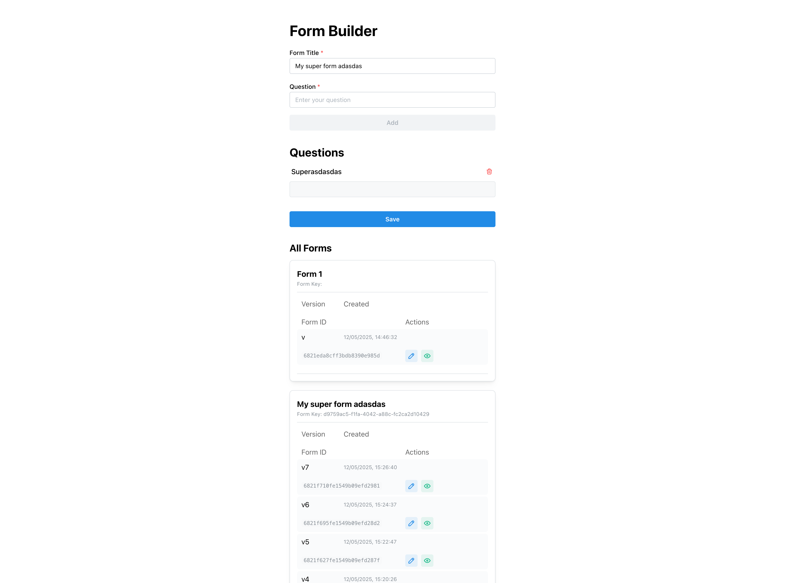

# Form Builder (React + TypeScript + Vite)

A modern, accessible form builder with versioning, built using React, TypeScript, Vite, and Mantine UI.

---

## Features

- **Form Versioning:** Every edit creates a new version, preserving history.
- **Inline Editing:** Edit question titles directly in the list.
- **Question Management:** Add and remove questions easily.
- **Version History:** View and edit any previous version of a form.
- **Accessible UI:** Built with Mantine for a clean, accessible experience.
- **API Integration:** Uses React Query for efficient data fetching and caching.

---

## Project Structure

```
client/
├── public/                # Static assets
│   └── screenshot.png
├── src/
│   ├── assets/            # Images and static assets
│   ├── components/        # Reusable UI components
│   │   ├── Form/
│   │   ├── InputText/
│   │   ├── Question/
│   │   └── ...
│   │
│   ├── contexts/          # React context providers
│   ├── hooks/             # Custom React hooks
│   ├── pages/             # Main app pages (routes)
│   │   ├── Builder.tsx    # Form builder UI
│   │   ├── Render.tsx     # Form rendering/submission UI
│   │   └── ...
│   │
│   ├── queries/           # React Query API logic
│   ├── types/             # Shared TypeScript types
│   ├── utils/             # Utility/helper functions
│   ├── App.tsx            # App entry point
│   ├── main.tsx           # Vite entry point
│   └── ...
│
├── package.json
├── tsconfig.json
├── vite.config.ts
└── README.md
```

---

## Screenshot



---

## Getting Started

1. **Install dependencies:**
   ```bash
   npm install
   ```

2. **Start the development server:**
   ```bash
   npm run dev
   ```
   The app will be available at [http://localhost:5173](http://localhost:5173)

3. **Build for production:**
   ```bash
   npm run build
   ```
   The output will be in the `dist/` folder.

4. **Preview the production build:**
   ```bash
   npm run preview
   ```
   This will serve the built app locally for testing.

---

## License

MIT
